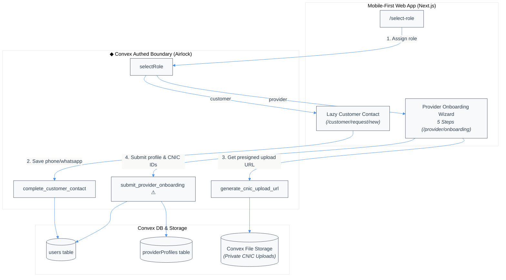
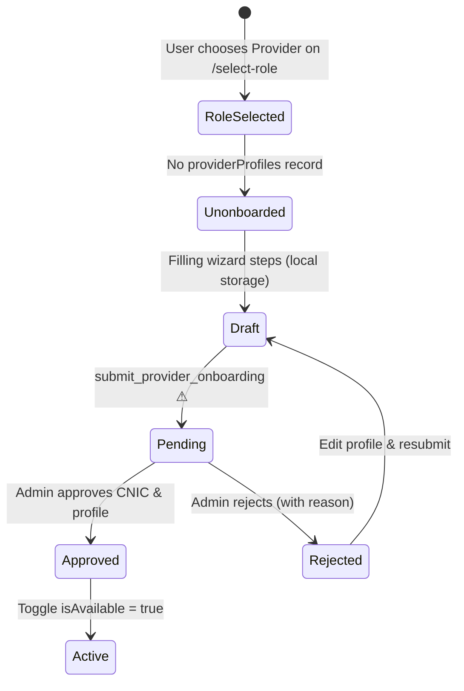

# Customer and Provider Onboarding Technical Design Document / RFC

| Document Metadata      | Details                                                                        |
| ---------------------- | ------------------------------------------------------------------------------ |
| Author(s)              | LabourIn Engineering Team                                                      |
| Status                 | Draft (RFC)                                                                    |
| Team / Owner           | Platform & Identity Team                                                        |
| Created / Last Updated | 2026-08-07                                                                     |

## 1. Executive Summary

This TDD specifies the end-to-end onboarding architecture for both Customer and Provider roles in LabourIn PK. Today, onboarding is only partially implemented up to role selection (`/select-role`). 

This proposal defines the post-role-selection onboarding pipeline:
1. **Customer Onboarding**: A lightweight, lazy contact completion workflow that captures phone and optional WhatsApp details at the point of intent (creating a service request), preventing drop-off during initial signup.
2. **Provider Onboarding**: A multi-step mobile-first wizard (`/provider/onboarding`) collecting identity, skill services, coverage areas, contact details, and CNIC front/back document uploads, transitioning the provider to a `pending` verification state.

The system centers on two core boundary doors: `submit_provider_onboarding` ⚠ (which moves a profile to pending review and securely registers CNIC document handles) and `complete_customer_contact` (which establishes verified contact information for booking).

## 2. Context and Motivation

### 2.1 Current State

The repository currently implements sign-in via Clerk and initial role assignment via `selectRole` in [convex/authed/account.ts](file:///I:/LabourIn/convex/authed/account.ts#L23-L59). The `users` table records `role: "customer" | "provider"`.

- **Current Leaks & Gaps**:
  - `selectRole` sets `role: "provider"`, but there is no `providerProfiles` table or schema to hold skill categories, operational cities/areas, or CNIC credentials.
  - Providers who have selected a role but not completed onboarding are redirected to placeholder routes without structured state tracking.
  - Customer contact details (phone, WhatsApp) are stored optionally on `users`, but no boundary door enforces phone verification or complete contact data before a customer submits a service request.
  - CNIC documents have no secure storage abstraction, risking accidental leakage to public provider listing queries.

### 2.2 The Problem

- **Trust & Verification Vacuum**: Without structured provider onboarding and CNIC verification, unverified accounts could appear in search or contact customers directly, exposing users to fraud or safety risks.
- **High Customer Friction**: Forcing customers to complete lengthy profile forms upfront leads to high acquisition drop-off. Customer contact details must be captured lazily when value is delivered.
- **Role Redirection Ambiguity**: Middleware and `RoleGate` cannot currently determine if a provider is fully onboarded, pending admin approval, or rejected.

## 3. Goals and Non-Goals

### 3.1 Functional Goals

- [ ] Provide a 5-step mobile-first onboarding wizard for providers (`/provider/onboarding`) covering Identity, Services & Experience, Coverage & Contact, Verification (CNIC uploads), and Review & Consent.
- [ ] Enforce backend validation ensuring provider profile data matches active categories, cities, and sub-areas.
- [ ] Securely upload and link CNIC front/back image storage IDs in Convex, accessible exclusively to internal functions and admin verification actions.
- [ ] Transition newly submitted provider profiles into a `pending` verification state and force provider availability to `false` until approved by an administrator.
- [ ] Implement lazy customer contact onboarding during request creation (`/customer/request/new`), saving verified contact details to the customer's user record.
- [ ] Provide clear state-aware routing (`unonboarded` -> `/provider/onboarding`, `pending` -> `/provider/pending`, `approved` -> `/provider`, `rejected` -> `/provider/onboarding?resubmit=true`).

### 3.2 Non-Goals (Out of Scope)

- [ ] Automated OCR or automated third-party API verification of CNIC documents (manual admin review only in MVP).
- [ ] Upfront mandatory 10-step customer profile forms before browsing providers.
- [ ] Payment gateway or bank account onboarding (out of scope for MVP).
- [ ] In-app video verification or background check integration.

## 4. Proposed Solution (High-Level Design)

### 4.1 System Architecture Diagram



### 4.2 Architectural Pattern

- **Lazy Contact Completion Pattern**: Customer contact details are requested on-demand at the point of request creation using Effect-validated Convex mutations.
- **Wizard State Machine & Draft Storage**: Provider onboarding uses React Hook Form + local storage persistence for draft retention across step transitions, culminating in a single atomic mutation call.
- **Capability-Based Document Uploads**: CNIC uploads use short-lived Convex storage upload URLs generated via authenticated mutations, storing raw `StorageId` references in a protected `providerProfiles` table.

### 4.3 Key Components

| Component | Responsibility | Stack | Justification |
| --- | --- | --- | --- |
| `ProviderOnboardingWizard` | Multi-step form UI with progress header & draft retention | React, React Hook Form, Zod | Mobile-first UX with client validation matching Convex rules |
| `CustomerContactDialog` | Lazy contact prompt for phone/WhatsApp during request flow | Radix Dialog, React Hook Form | Zero friction browsing; collects contact info only when booking |
| `convex/authed/onboarding.ts` | Authenticated mutation boundary for provider profile submission | Convex Authed + Effect v4 | Enforces role checks, entity validation, and state transitions |
| `convex/authed/storage.ts` | Generates presigned file upload URLs for CNIC images | Convex Authed | Isolates binary upload capabilities to authenticated sessions |

### 4.4 The Door Set at a Glance (Stranger-Across-Time View)

1. `select_role` — Assigns base identity role (`customer` or `provider`).
2. `complete_customer_contact` — Enforces verified contact details for customer service requests.
3. `generate_cnic_upload_url` — Grants temporary single-use upload capability for CNIC document images.
4. `submit_provider_onboarding` ⚠ — Submits provider profile and CNIC documents for admin review, transitioning profile status to `pending` and locking provider availability to `false`.
5. `get_provider_onboarding_status` — Queries current provider onboarding state (`unonboarded`, `pending`, `approved`, `rejected`) for route guards.

---

## 5. Detailed Design

### 5.1 The Doors (Entrypoint Contracts)

#### Door 1: `complete_customer_contact`
```typescript
complete_customer_contact(
  phoneNumber: PhoneNumberString, // Normalized E.164 phone number
  whatsappNumber?: PhoneNumberString,
): Result<UserDocument, ContactValidationError>
```
- **Guarantee**: Updates the authenticated customer's user record with verified phone and optional WhatsApp numbers, enabling service request creation.
- **Refusals**: Refuses invalid phone number formats, non-customer callers, and deleted user accounts.

#### Door 2: `generate_cnic_upload_url`
```typescript
generate_cnic_upload_url(): Result<UploadUrlString, StorageError>
```
- **Guarantee**: Generates a single-use presigned URL allowing the authenticated provider to upload a CNIC document image directly to Convex storage.
- **Refusals**: Refuses unauthenticated requests or callers with non-provider roles.

#### Door 3: `submit_provider_onboarding` ⚠
```typescript
submit_provider_onboarding(
  displayName: string,
  bio: string,
  experienceYears: number,
  primaryCategoryId: Id<"categories">,
  skillIds: Array<Id<"skills">>,
  cityId: Id<"cities">,
  areaIds: Array<Id<"areas">>,
  phoneNumber: string,
  whatsappNumber?: string,
  cnicFrontStorageId: Id<"_storage">,
  cnicBackStorageId: Id<"_storage">,
  cnicNumber: string, // Standard Pakistani CNIC (13 digits: XXXXX-XXXXXXX-X)
): Result<ProviderProfileId, OnboardingValidationError>
```
- **Guarantee**: Atomically creates or updates the provider's profile, links uploaded CNIC storage handles, sets verification status to `pending`, and explicitly forces `isAvailable = false`. Irreversible until admin review.
- **Refusals**: Refuses submissions where `areaIds` do not belong to `cityId`, where skill IDs do not match active categories, where CNIC files are missing, or where caller is not a `provider`.

#### Per-Door Audit Rubric

| Door | (1) Joint | (2) One sentence, no "and" | (3) Honest name | (5) Every exit | (6) Refusals real | (7) Trust transition | (8) One chokepoint |
| --- | --- | --- | --- | --- | --- | --- | --- |
| `complete_customer_contact` | ✅ business verb | ✅ "Updates customer contact numbers for requests" | ✅ | Validation error on invalid phone | Non-customer unrepresentable in caller context | n/a | ✅ Single door for customer contact |
| `generate_cnic_upload_url` | ✅ business verb | ✅ "Generates single-use CNIC upload URL" | ✅ | Storage allocation failure handled | Non-provider rejected | n/a | ✅ Single presigned upload capability |
| `submit_provider_onboarding` ⚠ | ✅ business verb | ✅ "Submits provider profile and CNIC documents for admin review" | ✅ ⚠ irreversible transition to pending queue | Re-submission overwrites draft/rejected profile | Invalid city/area/skill hierarchy rejected | n/a | ✅ Single chokepoint for provider registration |

### 5.2 API Interfaces (Convex Authed Functions)

The in-process Effect-TS handlers are exposed via `convex/authed/onboarding.ts`:

```typescript
// convex/authed/onboarding.ts
import { v } from "convex/values";
import { effectAuthedMutation, effectAuthedQuery } from "./helpers";
import { Effect } from "effect";

export const getProviderOnboardingStatus = effectAuthedQuery({
  args: {},
  handler: () => Effect.gen(function* () {
    // Returns { status: 'unonboarded' | 'pending' | 'approved' | 'rejected', profile?: ... }
  })
});

export const submitProviderOnboarding = effectAuthedMutation({
  args: {
    displayName: v.string(),
    bio: v.string(),
    experienceYears: v.number(),
    primaryCategoryId: v.id("categories"),
    skillIds: v.array(v.id("skills")),
    cityId: v.id("cities"),
    areaIds: v.array(v.id("areas")),
    phoneNumber: v.string(),
    whatsappNumber: v.optional(v.string()),
    cnicFrontStorageId: v.id("_storage"),
    cnicBackStorageId: v.id("_storage"),
    cnicNumber: v.string(),
  },
  handler: (args) => Effect.gen(function* () {
    // Enforces validation, updates users & providerProfiles tables
  })
});
```

### 5.3 Data Schema Changes

The Convex schema ([convex/schema.ts](file:///I:/LabourIn/convex/schema.ts)) will be expanded with the `providerProfiles` table and reference structures:

```typescript
// Additions to convex/schema.ts
providerProfiles: defineTable({
  userId: v.id("users"),
  displayName: v.string(),
  bio: v.string(),
  experienceYears: v.number(),
  primaryCategoryId: v.id("categories"),
  skillIds: v.array(v.id("skills")),
  cityId: v.id("cities"),
  areaIds: v.array(v.id("areas")),
  phoneNumber: v.string(),
  whatsappNumber: v.optional(v.string()),
  
  // Verification details (Private to admin & internal functions)
  cnicNumber: v.string(),
  cnicFrontStorageId: v.id("_storage"),
  cnicBackStorageId: v.id("_storage"),
  
  // Verification State Machine
  verificationStatus: v.union(
    v.literal("pending"),
    v.literal("approved"),
    v.literal("rejected")
  ),
  rejectionReason: v.optional(v.string()),
  
  // Availability toggle (Default false until approved)
  isAvailable: v.boolean(),
  
  createdAt: v.number(),
  updatedAt: v.number(),
})
  .index("by_user_id", ["userId"])
  .index("by_verification_status", ["verificationStatus"])
  .index("by_city_and_status", ["cityId", "verificationStatus"])
  .index("by_city_and_category_and_status", ["cityId", "primaryCategoryId", "verificationStatus"]),
```

### 5.4 State Machine & Workflow Transitions

#### Provider Onboarding State Lifecycle



### 5.5 UI/UX Component Architecture

#### 1. Provider Onboarding Multi-Step Wizard (`/provider/onboarding`)
- **Step 1: Identity** — Display Name, Profile Photo preview, Bio / Short summary.
- **Step 2: Services & Experience** — Primary category radio selection, multi-select skills within category, years of experience counter.
- **Step 3: Coverage & Contact** — Operating city dropdown, multi-select areas/neighborhoods within selected city, Phone number (pre-filled from Clerk if available), WhatsApp number toggle.
- **Step 4: CNIC Verification** — 13-digit CNIC input with mask (`XXXXX-XXXXXXX-X`), CNIC front image file dropzone with preview, CNIC back image file dropzone with preview. Secure privacy notice explicitly detailing that CNIC images are never shown publicly.
- **Step 5: Review & Submit** — Consolidated summary card of all entered info, confirmation checkbox, submit button with loading indicator.

#### 2. Customer Contact Completion Dialog (`components/customer/CustomerContactDialog.tsx`)
- Appears seamlessly during `/customer/request/new` if `user.phoneNumber` is missing.
- Input fields: Phone Number (required), WhatsApp Number (optional, defaults to same as phone).
- Save action calls `complete_customer_contact` mutation before proceeding with request submission.

---

## 6. Backwards Compatibility

- **Posture**: Allowed breaking changes and schema refactors (as confirmed for early MVP development stage).
- **Existing Users**: Users with `role: "provider"` who lack a `providerProfiles` record will be treated as `status: "unonboarded"` by middleware/`RoleGate` and automatically routed to `/provider/onboarding`.
- **Existing Schemas**: `users` table fields remain intact; new fields `phoneNumber` and `whatsappNumber` continue as optional on `users`, populated upon contact completion.

---

## 7. Security and Privacy Considerations

- **CNIC Data Isolation**: `cnicFrontStorageId`, `cnicBackStorageId`, and `cnicNumber` are strictly omitted from public provider search/profile queries (`getPublicProviderProfile`, `listProviders`). They are accessible solely through internal admin verification queries.
- **Storage Capability Safety**: `generate_cnic_upload_url` verifies that the identity subject has a `provider` role before issuing an upload endpoint.
- **Phone Number Protection**: Customer and provider direct phone numbers are hidden from public view until a service request is accepted by both parties.

---

## 8. Testing & Validation Plan

- **Unit Tests**: Form step schema validation (Zod rules for Pakistani phone numbers `03XXXXXXXXX` and CNIC format `XXXXX-XXXXXXX-X`).
- **Convex Integration Tests (`convex-test`)**:
  - `submitProviderOnboarding`: verifies creation of `providerProfiles` record with `pending` status, validates city/area relationship, rejects submission if CNIC storage IDs are missing.
  - `completeCustomerContact`: verifies phone update for customer role, rejects non-customer callers.
  - State guards: ensures unapproved providers cannot set `isAvailable = true`.
- **E2E / UI Scenarios**:
  - Provider onboarding wizard completion on 360px wide mobile viewport.
  - Refreshing mid-wizard retains step state from local draft.
  - Customer lazy contact modal trigger during request creation.

---

## 9. Resolved Design Decisions

1. **Draft Persistence**: Provider onboarding drafts are saved in `localStorage` for instant performance without unnecessary database writes. Drafts persist across browser reloads on the same device until submission.
2. **Contact & Network Provider Data**: Phone numbers are explicitly collected in Step 3 of Provider Onboarding (including optional phone network provider identification, e.g., Jazz, Telenor, Zong, Ufone, ONIC, to optimize local calling/messaging dispatch), rather than relying solely on social sign-in defaults.
3. **Profile Re-submission on Rejection**: If an admin rejects a profile, existing text fields and uploaded CNIC storage handles are retained so the provider only updates the flagged sections before resubmitting.

---

## 10. Execution Plan & Phased Subagent Task List

This plan divides the onboarding work into discrete, subagent-friendly phases. Dependencies and parallelization opportunities are explicitly noted.

### Dependency Graph & Parallelization Strategy
- **Phase 1 (Backend & Schema)** must be completed first.
- **Phase 2 (Customer UI)** and **Phase 3 (Provider UI Wizard)** can be executed **in parallel** once Phase 1 is complete.
- **Phase 4 (Routing & Guards)** requires completion of Phase 1 and key screens from Phase 3.
- **Phase 5 (Testing & Quality Gate)** runs after Phase 2, 3, and 4 complete.

```
       ┌────────────────────────┐
       │ [Phase 1] Core Backend │
       └───────────┬────────────┘
                   │
         ┌─────────┴─────────┐
         ▼                   ▼
┌─────────────────┐ ┌──────────────────┐
│ [Phase 2] Cust  │ │ [Phase 3] Prov   │
│ Lazy Contact UI │ │ Onboard Wizard UI│
└────────┬────────┘ └────────┬─────────┘
         │                   │
         └─────────┬─────────┘
                   ▼
       ┌────────────────────────┐
       │ [Phase 4] Route Guards │
       └───────────┬────────────┘
                   ▼
       ┌────────────────────────┐
       │ [Phase 5] E2E & Tests  │
       └────────────────────────┘
```

---

### Task Breakdown for Subagent Handoff

#### Phase 1: Database Schema & Core Convex Backend Doors
> **Dependency**: None (Prerequisite for all subsequent phases)  
> **Target Files**: `convex/schema.ts`, `convex/authed/onboarding.ts`, `convex/authed/storage.ts`, `convex/authed/contact.ts`, `convex/authed/onboarding.test.ts`

- [x] `- [Phase 1] Task 1.1`: Update `convex/schema.ts` to add `providerProfiles` table schema with all indexes (`by_user_id`, `by_verification_status`, `by_city_and_status`, `by_city_and_category_and_status`) and add optional `whatsappNumber` to `users` schema. Run `pnpm run convex:gen`.
- [x] `- [Phase 1] Task 1.2`: Implement `complete_customer_contact` mutation in `convex/authed/contact.ts` using Effect v4 (`effectAuthedMutation`), validating phone format (E.164 / `03XXXXXXXXX`) and updating caller user record.
- [x] `- [Phase 1] Task 1.3`: Implement `generate_cnic_upload_url` mutation in `convex/authed/storage.ts` using `effectAuthedMutation`, validating provider role and generating presigned Convex file upload URL.
- [x] `- [Phase 1] Task 1.4`: Implement `submit_provider_onboarding` mutation and `get_provider_onboarding_status` query in `convex/authed/onboarding.ts` using Effect v4. Enforce city/area and skill/category hierarchy validations, set `verificationStatus: "pending"`, and force `isAvailable: false`.
- [x] `- [Phase 1] Task 1.5`: Write `convex-test` integration tests in `convex/authed/onboarding.test.ts` covering validation failures, customer contact updates, and provider status transitions. Run `pnpm run typecheck`.

---

#### Phase 2: Customer Lazy Contact Onboarding UI
> **Dependency**: Blocked by Phase 1 (Can run concurrently with Phase 3)  
> **Target Files**: `components/customer/CustomerContactDialog.tsx`, `app/customer/request/new/page.tsx`

- [x] `- [Phase 2] Task 2.1`: Build `CustomerContactDialog` component using Radix Dialog / React Hook Form / Zod, handling mobile number (E.164) and optional WhatsApp number inputs.
- [x] `- [Phase 2] Task 2.2`: Integrate `CustomerContactDialog` into customer service request flow (`app/customer/request/new`), checking if customer profile lacks phone number and popping dialog before triggering request submission door.

---

#### Phase 3: Provider Onboarding Wizard UI & Local Storage Draft
> **Dependency**: Blocked by Phase 1 (Can run concurrently with Phase 2)  
> **Target Files**: `app/provider/onboarding/page.tsx`, `components/provider/wizard/*`

- [x] `- [Phase 3] Task 3.1`: Build `ProviderOnboardingWizard` multi-step shell (`app/provider/onboarding/page.tsx`) with 5-step progress header and `localStorage` draft saving/hydration.
- [x] `- [Phase 3] Task 3.2`: Implement Step 1 (Identity: display name, bio, experience years) and Step 2 (Services & Experience: category select, skill multi-select) form steps with React Hook Form + Zod.
- [x] `- [Phase 3] Task 3.3`: Implement Step 3 (Coverage & Contact: city, area multi-select, phone, optional network provider) and Step 4 (CNIC Verification: 13-digit masked CNIC, front/back image upload dropzones invoking `generate_cnic_upload_url`, privacy badge).
- [x] `- [Phase 3] Task 3.4`: Implement Step 5 (Review & Submit summary card, confirmation checkbox) and wire submission to `submitProviderOnboarding` mutation, redirecting to `/provider/pending` on success.

---

#### Phase 4: Routing, Middleware, and State-Aware Route Guards
> **Dependency**: Blocked by Phase 1 & Phase 3  
> **Target Files**: `middleware.ts`, `components/auth/RoleGate.tsx`, `app/provider/pending/page.tsx`

- [x] `- [Phase 4] Task 4.1`: Update `middleware.ts` / `RoleGate.tsx` to handle provider onboarding statuses (`unonboarded` -> `/provider/onboarding`, `pending` -> `/provider/pending`, `approved` -> `/provider`, `rejected` -> `/provider/onboarding?resubmit=true`).
- [x] `- [Phase 4] Task 4.2`: Build `/provider/pending` status page (displaying pending review message and submission summary) and implement draft pre-fill handling for rejected profile resubmission (`/provider/onboarding?resubmit=true`).

---

#### Phase 5: Testing, Validation & Diagnostics
> **Dependency**: Blocked by Phase 2, Phase 3, Phase 4  
> **Target Files**: Entire repository

- [x] `- [Phase 5] Task 5.1`: Run `pnpm run convex:gen`, `pnpm run lint`, and `pnpm run typecheck` to ensure full backend/frontend type safety and zero lint warnings.
- [x] `- [Phase 5] Task 5.2`: Run mobile viewport UI smoke tests (360px width) verifying wizard step transitions, local storage draft recovery, and customer contact modal triggers.


